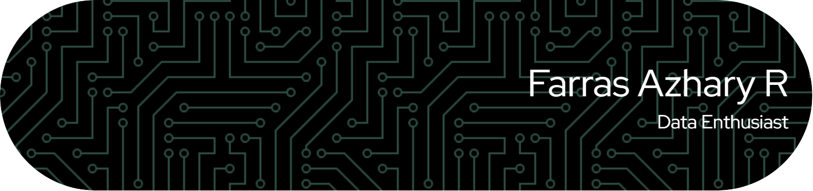

  

# Hi There! 

Welcome to my GitHub profile! I'm a passionate data scientist who loves exploring new algorithm and building impactful projects.

### 💻 Tech Stack

**Languages**

**Frameworks & Libraries**

**Databases**

**Tools**

### 🌐 Socials:
 

<picture>
  <source media="(prefers-color-scheme: dark)" srcset="https://raw.githubusercontent.com/farrazhary/farrazhary/output/pacman-contribution-graph-dark.svg">
  <source media="(prefers-color-scheme: light)" srcset="https://raw.githubusercontent.com/farrazhary/farrazhary/output/pacman-contribution-graph.svg">
  
</picture>

